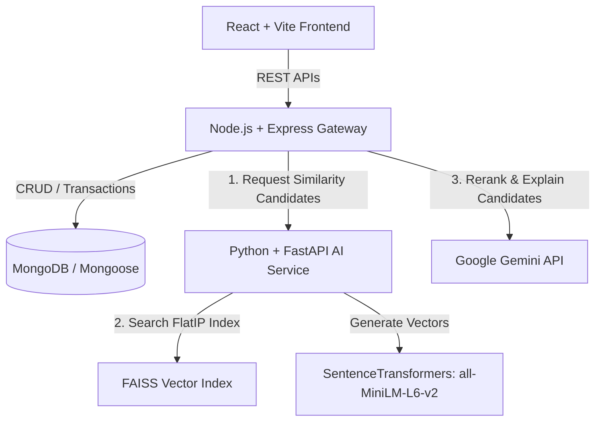

# Filmly 🎬

Filmly is a modern, AI-powered social movie platform that moves beyond static, genre-based recommendations. It builds dynamic, vector-space user profiles using user behavior (reviews, ratings, watchlists) and uses a **two-stage hybrid recommendation pipeline** combining **vector similarity search** and **Large Language Models (LLMs)** to recommend and explain matches in natural language.

---

## 🚀 Key Features

*   **🧠 Dynamic User Profiling (Vector Embeddings):** Generates a weighted vector representing a user's movie taste by analyzing their favorites ($2.0\times$ weight), reviews ($1.0\times$ weight), and watchlist ($0.5\times$ weight).
*   **🔍 Two-Stage AI Recommendation Pipeline:**
    *   **Stage 1 (Retrieval):** Uses **FAISS** (Facebook AI Similarity Search) and `SentenceTransformers` to pull the top 25 most semantically similar movie candidates.
    *   **Stage 2 (Reasoning & Reranking):** Passes candidates to the **Gemini API** (`gemini-2.5-flash`) to select the top 12 matches, sort them, and write custom explanations (e.g., *"We recommend this because you rated Inception 9/10"*).
*   **💬 Natural Language Semantic Search:** Allows users to find movies using contextual queries (e.g., *"mind-bending space thriller with a twist ending"*) through sentence embedding similarity search and high-speed retrieval.
*   **⚡ AI Taste Summaries:** Employs Gemini to generate a punchy, single-sentence summary of the user's current movie palate on their dashboard page dynamically.
*   **👥 Social Graph & Activity Feed:** A full-featured friendship system (requests, accepts, rejects) that tracks movie ratings and watchlist changes, presenting a real-time collaborative activity feed.

---

## 🏗️ Architecture Overview

Filmly uses a decoupled microservices architecture designed to isolate heavy machine learning tasks from web-serving threads.



### Technology Stack
*   **Frontend:** React (Vite), React Router, Vanilla CSS, Axios
*   **Backend:** Node.js, Express, Mongoose (MongoDB), JWT Authentication, Joi (validation)
*   **AI Service:** Python, FastAPI, Uvicorn, SentenceTransformers (`all-MiniLM-L6-v2`), FAISS-CPU, NumPy, PyMongo
*   **LLM Integration:** Google Generative AI (`gemini-2.5-flash`)

---

## 📁 Repository Structure

```
├── backend/            # Express.js backend server
│   ├── models/         # Mongoose schemas (users, movies, reviews, etc.)
│   ├── routes/         # Express routers (auth, recommendations, friends)
│   ├── utilities/      # Helpers (profile rebuild, error wrapping)
│   └── index.js        # Main entry point
├── frontend/           # React single-page application
│   ├── src/            # Components, styles, contexts, routing
│   └── package.json    # Frontend dependency manifests
└── AI_service/         # Python FastAPI AI microservice
    ├── app/            # FastAPI app routers and models
    ├── scripts/        # FAISS index building and utility scripts
    └── requirements.txt# Python dependency packages
```

---

## 🛠️ Getting Started & Setup

### Prerequisites
*   [Node.js](https://nodejs.org/) (v16+ recommended)
*   [Python 3.10+](https://www.python.org/)
*   [MongoDB](https://www.mongodb.com/) (Local or Atlas)
*   Google Gemini API Key

---

### 1. AI Service Setup
1. Navigate to the `AI_service` folder:
    ```bash
    cd AI_service
    ```
2. Create and activate a Python virtual environment:
    ```bash
    python -m venv .venv
    # Windows:
    .venv\Scripts\activate
    # macOS/Linux:
    source .venv/bin/activate
    ```
3. Install required packages:
    ```bash
    pip install -r requirements.txt
    ```
4. Create an `AI_service/.env` file:
    ```env
    MONGO_URI=mongodb://localhost:27017/filmly
    ```
5. Run the FastAPI development server:
    ```bash
    uvicorn app.main:app --reload --port 8000
    ```

---

### 2. Backend Setup
1. Navigate to the `backend` folder:
    ```bash
    cd ../backend
    ```
2. Install dependencies:
    ```bash
    npm install
    ```
3. Create a `backend/.env` file:
    ```env
    PORT=5000
    MONGO_URI=mongodb://localhost:27017/filmly
    JWT_SECRET=your_super_secret_jwt_key
    AI_SERVICE_URL=http://localhost:8000
    GEMINI_API_KEY=your_gemini_api_key_here
    GEMINI_MODEL=gemini-2.5-flash
    APP_TIMEZONE=UTC
    ```
4. Start the server:
    ```bash
    npm start
    ```

---

### 3. Frontend Setup
1. Navigate to the `frontend` folder:
    ```bash
    cd ../frontend
    ```
2. Install dependencies:
    ```bash
    npm install
    ```
3. Create a `frontend/.env` file:
    ```env
    VITE_API_URL=http://localhost:5000
    ```
4. Start the Vite client dev server:
    ```bash
    npm run dev
    ```

---

## 🔌 API Reference Highlights

### Node.js Backend Gateway

| Method | Endpoint | Description | Auth Required |
| :--- | :--- | :--- | :---: |
| `POST` | `/api/auth/register` | Register a new user profile | No |
| `POST` | `/api/auth/login` | Log in and receive HTTP-only cookies | No |
| `GET` | `/api/dashboard-summary` | Get stats, recent activity, and Gemini Taste Summary | Yes |
| `GET` | `/api/recommendations` | Get Gemini explained and reranked movie matches | Yes |
| `GET` | `/api/semantic-search` | Query database semantically using natural language | Yes |
| `POST` | `/api/friends/request/:touserId` | Send friend request to another user | Yes |

### Python AI Service

| Method | Endpoint | Description |
| :--- | :--- | :--- |
| `POST` | `/analyze` | Generate vector embedding for input string |
| `POST` | `/recommend` | Execute FAISS inner-product vector search on embeddings |
| `POST` | `/rebuild-index` | Re-fetch movies from MongoDB and rebuild the local FAISS index |

---

## 🧠 Optimization & System Design Decisions

1. **EVENT-LOOP SANITY (FastAPI Microservice):** Python handles CPU-bound sentence encoding and matrix index search. Node.js manages I/O-bound database reads, sessions, and HTTP routing, preventing CPU-starvation bugs.
2. **LLM INFERENCE OPTIMIZATION:** Running semantic search directly on an LLM is slow and costly. Our pipeline uses a vector database approach (**FAISS**) for the retrieval phase, ensuring only the top candidate vectors are parsed by the LLM for explanations.
3. **FAISS SCHEDULING:** FastAPI uses an asynchronous background thread that updates the FAISS search index every 15 minutes, maintaining recommendation accuracy without impacting web requests.

---

## 📄 License
This project is licensed under the MIT License - see the [LICENSE](LICENSE) file for details.